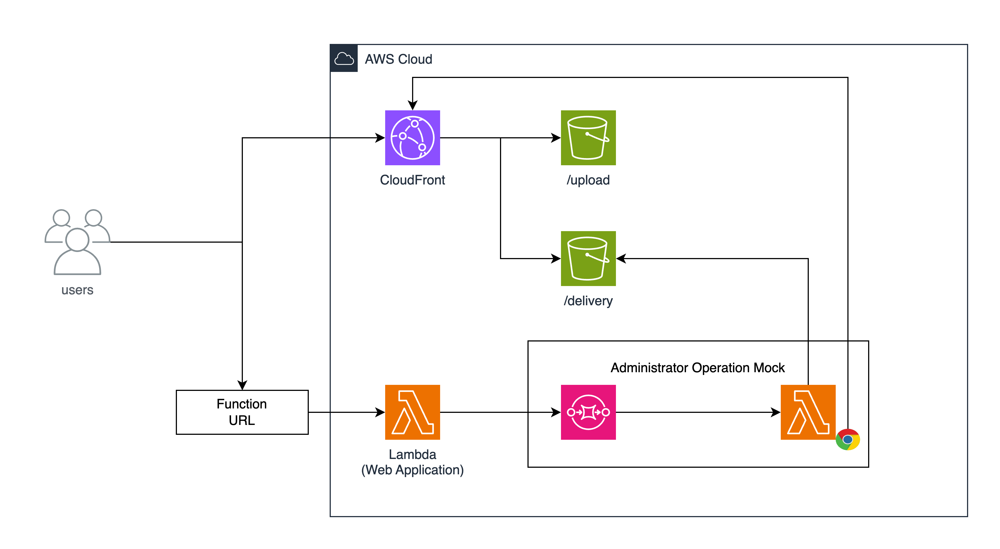

# シナリオ 3 - POST Policy を用いた任意の HTML ファイルのアップロード

[English](./README.en.md) / [Top](../../README.md)

## 起動

```sh
make start-Scenario3
```

## 概要

このシナリオは、POST Policy を用いた任意の HTML ファイルのアップロードを模したアプリケーションと管理者がチャレンジの対象となります。チャレンジの最終的な目的は、問い合わせ窓口の先にいる管理者の Cookie を取得することです。

**類似のシナリオ**

- [シナリオ 1 - SDK を用いた任意の HTML ファイルのアップロード](../scenario1/README.md)
- [シナリオ 2 - 署名付き URL を用いた任意の HTML ファイルのアップロード](../scenario2/README.md)

管理者の動きは、シナリオ 1 同様に"Administrator Operation Mock"が模擬的に行います。管理者は、ユーザーから送られたアプリケーションの URL を閲覧し、その結果を`/delivery`の S3 に保存をします。



## Solution

ここからは、このシナリオの解決策を説明します。

### 動作の整理

対象となるアプリケーションでは、以下のような動作を行います。

1. User は Application のエンドポイントに対してファイルをアップロードするリクエストを送信します。
2. Application は、リクエストを受け取り、そのファイルを S3 にアップロード可能な POST Policy を生成します。
   - この際、Application は、UUIDv4 を生成し、その UUIDv4 をファイル名として S3 にアップロード可能な POST Policy を生成します。
3. User は、その POST Policy を用いて、ファイルを S3 にアップロードします。
4. S3 は、そのファイルを受け取り、そのファイルを保存します。
5. Application は、そのファイルのファイル名を User に返却します。
6. User は、そのファイル名を用いて、そのファイルを閲覧することが可能です。

### ソースコードの確認

大まかな実装は、シナリオ 1 と 2 と同様のものとなっていますが、POST Policy を生成するために、`createPresignedPost` 関数を用いています。

`cdk/lib/scenario3/application/src/app.ts` の `/api/upload` に実装が行われています。

```typescript
server.post<{
  Body: {
    contentType: string;
    length: number;
  };
}>('/api/upload', async (request, reply) => {
  if (!request.body.contentType || !request.body.length) {
    return reply.code(400).send({ error: 'No file uploaded' });
  }

  if (request.body.length > 1024 * 1024 * 100) {
    return reply.code(400).send({ error: 'File too large' });
  }

  const filename = uuidv4();
  const s3 = new S3Client({});
  const { url, fields } = await createPresignedPost(s3, {
    Bucket: process.env.BUCKET_NAME!,
    Key: `upload/${filename}`,
    Conditions: [
      ['content-length-range', 0, 1024 * 1024 * 100],
      ['starts-with', '$Content-Type', 'image'],
    ],
    Fields: {
      'Content-Type': request.body.contentType,
    },
    Expires: 600,
  });
  return reply.header('content-type', 'application/json').send({
    url,
    fields,
  });
});
```

当該実装を見ると、API は`contentType` と `length` の 2 つのパラメータを受信し、それらを用いて POST Policy を生成し、生成された POST Policy をレスポンスとして、返却しています。

POST Policy には、`Conditions` と `Fields` が含まれており、`Conditions` には、`content-length` と `Content-Type` の条件が含まれています。

これら制約においてみるべきは、`Content-Type` に対する条件が、`image` で始まることとなっています。

本来であれば`image/`のように、Type を厳密に指定するべきですが、`image`で始まることで、`image/png`や`image/jpeg`以外にも、`image`で始まる任意の文字列を指定することが可能です。

### 攻略の糸口

Post Policy における制約において、`Content-Type` の値は `image` から始まる任意の値であれば良いことがわかります。そのため、`image` から始まり、ブラウザが HTML として解釈できる値を設定することで、シナリオ 1 や 2 と同様に、任意の HTML ファイルをアップロードすることが可能です。

この場合、`Content-Type` には、`image/svg+xml`を設定することで、任意の HTML ファイルをアップロードすることが可能です。

また、svg ファイル以外にも、MimeType として認識できない値 (例: `image`) を設定することで、ブラウザは MimeSniffing を行い、推測されたファイル形式でファイルをレンダリングします。

大まかな流れはシナリオ 1 と同様です。

以下の HTML ファイルを `xss.html` として保存します。

```html
<!-- xss.html -->
<html>
  <body>
    <script>
      document.getElementsByTagName('body')[0].innerHTML = `${document.cookie.split('=')[1]}`;
    </script>
  </body>
</html>
```

保存した HTML ファイルをフォームに設定し、`POST` リクエストを送信することで、任意の HTML ファイルをアップロードすることが可能です。

その後、出力された URL を Report URL に入力することで、管理者の画面で任意の JavaScript を実行することが可能です。
実行後は、`/delivery/{uuid}`の S3 に保存されたファイルを閲覧することで、管理者の Cookie を含んだ HTML ファイルを閲覧することが可能です。

## チャレンジの回答

```
flag{c137e5b9b7afd4b13a15839a26153940beeefc7d}
```

## アップローダーの修正方法

最後に、アップローダーの修正方法を説明します。

`cdk/lib/scenario3/application/src/app.ts` の `/api/upload` に実装が行われています。
これらを修正するためには、`createPresignedPost` 関数において、設定される `Conditions` の `Content-Type` にスラッシュまで含むように修正する必要があります。また、SVG ファイルがアップロードされる可能性があるため、`Content-Disposition` に `attachment` を含めるように修正する必要があります。

```typescript
const { url, fields } = await createPresignedPost(s3, {
  Bucket: process.env.BUCKET_NAME!,
  Key: `upload/${filename}`,
  Conditions: [
    ['content-length-range', 0, 1024 * 1024 * 100],
    ['starts-with', '$Content-Type', 'image/'],
    ['starts-with', '$Content-Disposition', `attachment; filename="${filename}"`],
  ],
  Fields: {
    'Content-Type': request.body.contentType,
    'Content-Disposition': `attachment; filename="${filename}"`,
  },
  Expires: 600,
});
```
