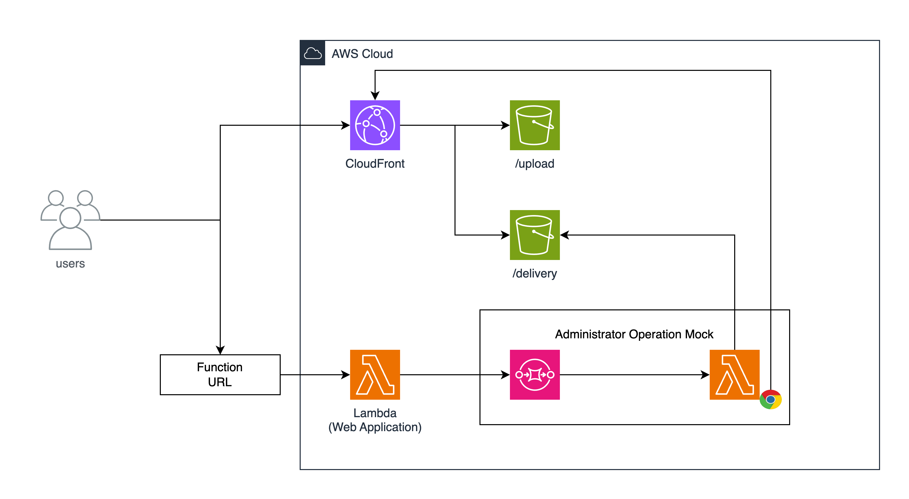

# シナリオ 5 - Content-Type の組み立ての不備と任意のファイルのアップロード (Content extension)

[English](./README.en.md) / [Top](../../README.md)

## 起動

```sh
make start-Scenario5
```

## 概要

このシナリオは、Content-Type の組み立ての不備と任意のファイルのアップロードを模したアプリケーションと管理者がチャレンジの対象となります。チャレンジの最終的な目的は、問い合わせ窓口の先にいる管理者の Cookie を取得することです。

また、このシナリオ 5 では、シナリオ 4 のチャレンジを前提としていますので、それらのシナリオを先にチャレンジしてください。

**前提となるシナリオ**

- [シナリオ 4 - Validation の Bypass と任意の HTML ファイルのアップロード](../scenario4/README.md)

また、このシナリオの構成に関しても、シナリオ 4 と同様の構成となっています。



## Solution

### 動作の整理

対象となるアプリケーションでは、以下のような動作を行います。

1. User は Application のエンドポイントに対してファイルをアップロードするリクエストを送信します。
2. Application は、リクエストを受け取り、そのファイルを S3 にアップロード可能な署名付き URL を生成します。
   - この際、Application は、UUIDv4 を生成し、その UUIDv4 をファイル名として S3 にアップロード可能な署名付き URL を生成します。
3. User は、その署名付き URL を用いて、ファイルを S3 にアップロードします。

### ソースコードの確認

基本的にはシナリオ 4 と同様の実装となっていますが、`getSignedUrl` 関数を用いて、署名付き URL を生成しています。

```typescript
server.post<{
  Body: {
    extention: string;
    length: number;
  };
}>('/api/upload', async (request, reply) => {
  if (!request.body.extention || !request.body.length) {
    return reply.code(400).send({ error: 'No file uploaded' });
  }

  if (request.body.length > 1024 * 1024 * 100) {
    return reply.code(400).send({ error: 'File too large' });
  }

  const denyStringRegex = /[\s\;()]/;

  if (denyStringRegex.test(request.body.extention)) {
    return reply.code(400).send({ error: 'Invalid file type' });
  }

  const allowExtention = ['png', 'jpeg', 'jpg', 'gif'];

  const isAllowExtention = allowExtention.filter((ext) => request.body.extention.includes(ext)).length > 0;
  if (!isAllowExtention) {
    return reply.code(400).send({ error: 'Invalid file extention' });
  }

  const contentType = `image/${request.body.extention}`;
  const filename = uuidv4();
  const s3 = new S3Client({});
  const command = new PutObjectCommand({
    Bucket: process.env.BUCKET_NAME,
    Key: `upload/${filename}`,
    ContentLength: request.body.length,
    ContentType: contentType,
  });

  const url = await getSignedUrl(s3, command, {
    expiresIn: 60 * 60 * 24,
    signableHeaders: new Set(['content-type']),
  });
  return reply.header('content-type', 'application/json').send({
    url,
    filename,
  });
});
```

このコードを見ると、`Content-Type` の組み立てに文字列の結合を行っていることがわかります。

```typescript
const contentType = `image/${request.body.extention}`;
```

この組み立てでは、`image/`と`request.body.extention`の結合を行っています。この組み立てでは、`request.body.extention`の値が`png`であった場合、`Content-Type`は`image/png`となります。

このような組み立ての場合、先のシナリオ 4 で示した RFC8941 を用いてバイパスを行うことが可能です。

`test.png,text/html`のように、`Content-Type`を`text/html`としてアップロードすることで、任意の`Content-Type`を指定してアップロードすることが可能です。

### 攻略の糸口

攻略方法はソースコードの確認で示した通りで、`test.png,text/html`のようなファイル名を指定することで、`Content-Type`を`image/png,text/html`としてアップロードすることで、任意の`Content-Type`を指定してアップロードすることが可能です。

その後は、シナリオ 4 と同様の方法で、管理者の Cookie を取得することが可能です。
